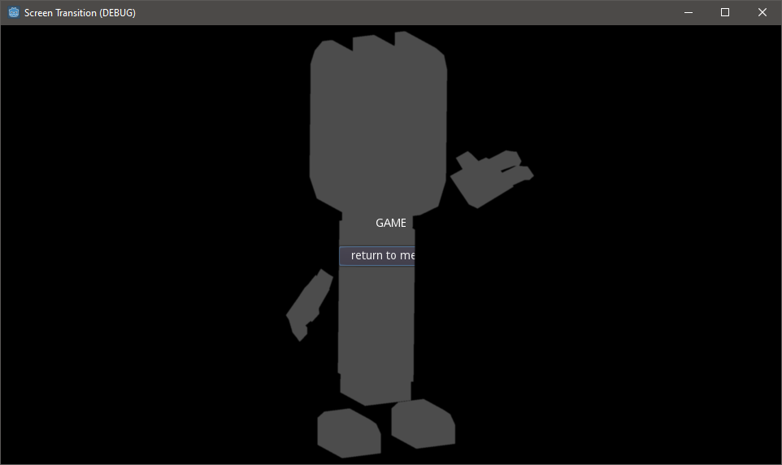

# Godot Screen Transition Tutorial

This project demonstrates how to use an input image and a shader to create a silhouette transition between scenes in Godot 3.5.

### License
This project is released under the MIT License. Please see the `LICENCE` file for more information.

Sound effects courtesy of Kenney.nl (https://kenney.nl/assets/interface-sounds), license CC0 1.0.
